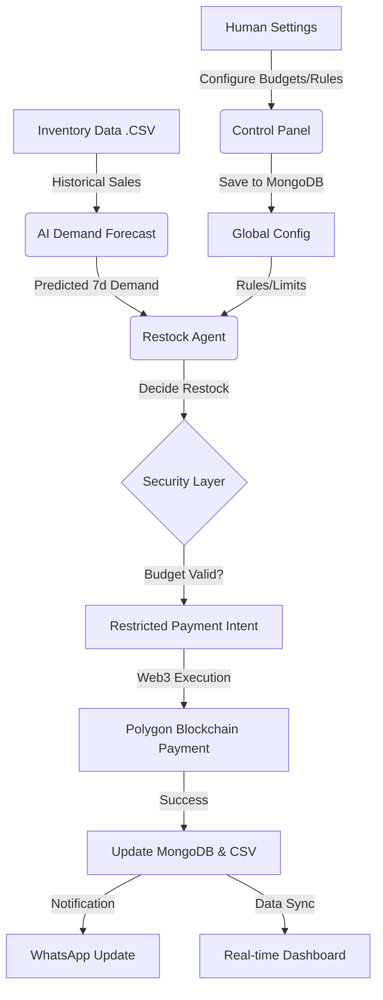

# Autonomous Inventory Management & Agentic Payment System

An AI-powered inventory management platform that automatically monitors stock levels, predicts demand, triggers restocking, and executes supplier payments using autonomous agents and blockchain technology.

---

# Problem

Small retailers and supply chain operators often face challenges such as:

• manual inventory tracking
• delayed supplier payments
• stock shortages or overstocking
• inefficient procurement decisions

These problems reduce operational efficiency and increase business risk.

---

# Solution

This project introduces an **Autonomous Inventory Management System with Agentic Payments**.

The system uses AI to monitor inventory levels, predict product demand, automatically place restocking orders, and execute supplier payments securely using blockchain infrastructure.

---

# Key Features

• AI-based inventory demand prediction
• Autonomous restocking decisions
• Agent-based payment execution
• Blockchain transaction logging
• Real-time inventory dashboard
• Supplier management system
• Fraud and anomaly detection

---

# Tech Stack

Frontend
React + Vite + TypeScript

Backend
FastAPI / Node.js

AI / ML
Python (demand forecasting, anomaly detection)

Blockchain
Ethereum / Polygon Smart Contracts

Database
PostgreSQL / MongoDB

---
## 🧠 System Architecture & Workflow



# How It Works

1. Inventory levels are continuously monitored
2. AI predicts upcoming demand
3. System triggers restocking when inventory drops below threshold
4. Supplier order is generated
5. Autonomous agent executes payment
6. Payment is recorded on blockchain

---

# System Architecture

```
Inventory Dashboard
        │
        ▼
Backend API
        │
        ▼
AI Demand Prediction
        │
        ▼
Autonomous Restocking Agent
        │
        ▼
Smart Contract Payment
        │
        ▼
Blockchain Network
```

---

# Project Structure

```
Autonomous_Agentic_payment_system
│
├── README.md
├── LICENSE
├── CONTRIBUTING.md
├── CODE_OF_CONDUCT.md
├── CHANGELOG.md
│
├── src
│   ├── backend
│   ├── frontend
│   └── ml
│
├── docs
├── tests
├── examples
└── .github
```

---

# Installation

Clone the repository

```
git clone https://github.com/Avirup1705/Autonomous_Agentic_payment_system.git
```

Navigate to the project directory

```
cd Autonomous_Agentic_payment_system
```

---

## Backend Setup

Install dependencies

```
pip install -r requirements.txt
```

Run backend server

```
uvicorn main:app --reload
```

---

## Frontend Setup

```
cd src/frontend/Autonomous_Agentic_payment_system
npm install
npm run dev
```

---

# Environment Variables

Create a `.env` file based on `.env.example`

Example:

```
DATABASE_URL=
BLOCKCHAIN_RPC_URL=
PRIVATE_KEY=
SUPPLIER_ADDRESS=
```

---

# AI / ML Module

The machine learning module performs:

• demand forecasting
• anomaly detection
• inventory optimization

Datasets are stored in:

```
src/ml/data
```

---


# Contributing

We welcome contributions.

Please read:

```
CONTRIBUTING.md
```

before opening a pull request.

---

# Contributors

<a href="https://github.com/Avirup1705/Autonomous_Agentic_payment_system/graphs/contributors">
  
</a>

---

# License

Apache License 2.0

See the LICENSE file for details.

---
