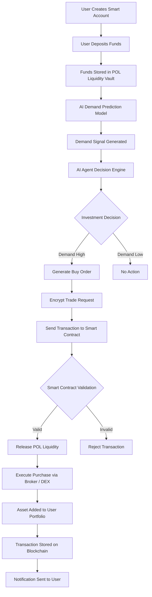

# ROADMAP.md

# Autonomous AI Investment Agent — Project Roadmap

This project aims to build an **AI-powered autonomous investment agent** that manages a user-funded smart account and automatically purchases assets based on demand signals.

The system integrates:

* AI Demand Prediction
* Autonomous AI Agents
* Protocol-Owned Liquidity (POL)
* Blockchain Smart Contracts
* Secure Automated Payments

---

# System Architecture Flow

---

# Version 1.0 — Hackathon Submission

The first version focuses on demonstrating the **core autonomous investment system**.

### Implemented Features

* Demand Prediction Model using machine learning
* AI agent decision engine
* Smart account creation with fixed user deposit
* Buy-only investment policy
* Basic backend infrastructure
* Protocol-owned liquidity fund structure

---

# Version 1.1 — Model Improvements

Planned improvements to the AI prediction engine.

### Features

* Advanced ML models (XGBoost / Gradient Boosting)
* Real-time financial data ingestion
* Demand signal optimization
* Feature importance visualization
* Improved model accuracy

---

# Version 1.2 — Autonomous Agent Upgrade

Enhancing the intelligence of the decision agent.

### Features

* Reinforcement Learning investment strategies
* Portfolio optimization
* Risk control system
* Dynamic trade sizing
* AI decision explainability

---

# Version 1.3 — Blockchain Infrastructure

Full blockchain integration for security and transparency.

### Features

* Smart contract-based investment vault
* On-chain transaction verification
* AI decision audit trail
* Decentralized trade validation

---

# Version 2.0 — Fully Autonomous Investment Protocol

Long-term vision of the system.

### Features

* Multi-asset investment support
* Decentralized governance
* AI portfolio management
* Multi-agent trading system
* Advanced risk management

---

# Known Technical Limitations

Current limitations that will be addressed in future versions:

* Demand model uses static datasets
* Limited broker/DEX integration
* Security layer for automated transactions still evolving
* Smart contract infrastructure in early stage
* No real-time financial data integration yet

---

# Call for Contributors

We are actively looking for contributors in the following areas.

### Machine Learning

* Demand forecasting models
* Reinforcement learning agents
* Financial signal analysis

### Blockchain Development

* Smart contract development
* Protocol-owned liquidity architecture
* On-chain verification systems

### Backend Engineering

* API development
* Broker integrations
* Transaction processing pipelines

### Frontend Development

* Investment dashboard
* Portfolio visualization
* Agent monitoring interface

---

# Long-Term Vision

The goal of this project is to create a **secure autonomous AI investment protocol** where users deploy intelligent agents that manage capital under transparent blockchain-enforced rules.
