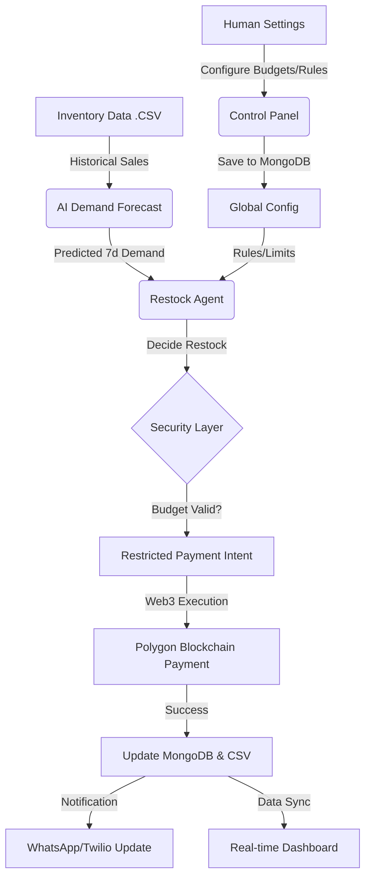

# Payventory Roadmap 🚀

Payventory aims to build a **fully autonomous inventory management and agentic payment protocol** where AI agents monitor stock levels and execute blockchain-enforced payments under transparent, user-defined rules.

The system integrates:
- **AI Demand Prediction**: Deep learning models to forecast inventory needs.
- **Autonomous Agents**: Intelligent decision-makers that trigger restocks.
- **Protocol-Owned Liquidity (POL)**: Smart account-based fund management.
- **Blockchain Execution**: Secure, audited payments on the Polygon network.
- **Real-time Synchronization**: Unified data between MongoDB, CSVs, and the Dashboard.

---

## 🏗️ System Architecture Flow

---

## 📍 Phase 1: Core Automation (Current State)
Focused on demonstrating the **autonomous commerce cycle**.
- [x] AI Demand Forecast (LSTM/Prophet models)
- [x] Autonomous Restock Decision Logic
- [x] Unified "Payventory" Database (MongoDB)
- [x] WhatsApp/Twilio Notifications
- [x] Live Monitoring Dashboard
- [x] Smart Account Payment Simulation

## 📍 Phase 2: Intelligence & Optimization (v1.1)
Planned improvements to the AI brain.
- [ ] Real-time demand ingestion (Webhooks)
- [ ] Multi-supplier competitive bidding
- [ ] Anomaly detection for fraud/theft
- [ ] Dynamic budget re-allocation based on ROI
- [ ] Advanced warehouse heatmaps

## 📍 Phase 3: Web3 & Trust (v1.2)
Full blockchain hardening.
- [ ] On-chain audit trail for every agent decision
- [ ] DAO-based budget governance
- [ ] Smart Contract Vault for supplier escrows
- [ ] Reputation-based supplier scoring (on-chain)

## 📍 Phase 4: Scaling & Integration (v2.0)
The global vision.
- [ ] Multi-warehouse support
- [ ] Integration with major ERPs (SAP, Netsuite)
- [ ] Cross-chain payment settlement (LayerZero)
- [ ] Predictive maintenance for logistics fleets

---

## 🛠️ Known Technical Limitations
- **Latency**: Python ML processing time can affect real-time sync.
- **Transaction Costs**: Gas fees on Polygon (addressed via Bundlers).
- **Cold Starts**: Render/Vercel free tier spin-up times.

## 🤝 Call for Contributors
We are looking for experts in:
- **ML/DS**: Forecasting accuracy and RL agents.
- **Web3**: Account Abstraction and Smart Contract security.
- **DevOps**: Scalable infrastructure for AI workloads.
