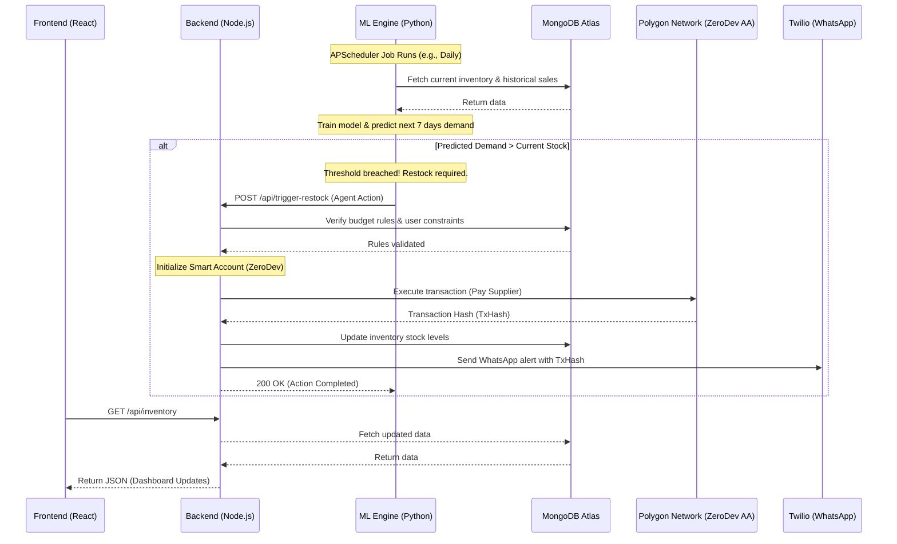

# Architecture Overview: Payventory

Payventory is an AI-powered inventory management platform designed around a robust microservices architecture. It combines a modern React frontend with a Node.js backend for traditional operations and blockchain interactions, while delegating heavy machine learning computations and agentic decision-making to a dedicated Python engine.

---

## 🏗️ System Components

The system is composed of three primary services:

1.  **Frontend (React + Vite)**
    *   **Role**: Provides the user interface, real-time dashboards, and control panels.
    *   **Key Tech**: React, React Router, Tailwind CSS (implied via styling patterns), Recharts (for analytics), Lucide Icons.
    *   **Responsibilities**: Rendering inventory status, visualizing ML predictions, managing authentication state, and triggering manual operations.

2.  **Backend (Node.js + Express)**
    *   **Role**: The central orchestrator and data gateway.
    *   **Key Tech**: Express.js, Mongoose (MongoDB), Web3.js / Ethers.js, ZeroDev SDK.
    *   **Responsibilities**:
        *   Managing the MongoDB database (Users, Inventory data).
        *   Handling authentication (JWT).
        *   Executing blockchain transactions via Polygon Account Abstraction (ERC-4337 smart accounts).
        *   Serving as a proxy between the Frontend and the ML Engine.

3.  **ML Engine & Autonomous Agents (Python + FastAPI)**
    *   **Role**: The "brain" of Payventory, responsible for forecasting and autonomous actions.
    *   **Key Tech**: FastAPI, Pandas, APScheduler (for cron jobs), Scikit-Learn/Prophet (for predictions).
    *   **Responsibilities**:
        *   Running daily/hourly cron jobs to analyze inventory levels.
        *   Training models on historical sales data to predict future demand.
        *   Triggering external actions (e.g., calling the Backend to execute a payment or sending Twilio WhatsApp alerts) when stock falls below predicted thresholds.

---

## 🔄 Data Flow & Interaction

The following Mermaid sequence diagram illustrates a typical autonomous restock cycle and payment flow.

---

## 🔐 Security Context

-   **Authentication**: The Frontend issues JWT tokens upon login, which are required for protected Backend routes.
-   **Blockchain execution**: Restock payments are non-custodial. The backend uses Account Abstraction (ZeroDev) to execute gasless or sponsored transactions representing the user's intent, governed by the smart contract rules.
-   **Agent Boundaries**: The Python ML Engine cannot directly execute payments. It must submit a request to the Node.js backend, which enforces budget constraints before executing the transaction on-chain.
